# Student Performance Prediction - Data Science Web Application

A machine learning project that predicts student exam performance based on various demographic and educational factors. The model is deployed as a web application using Flask, with infrastructure on AWS and Azure.

## 🎯 Problem Statement

Predict student exam performance based on demographic and educational factors to identify at-risk students for early intervention. This helps educators:
- Personalize support strategies
- Improve overall academic outcomes
- Allocate resources efficiently
- Early identification for remedial programs

## 📊 Dataset

**Source:** [Kaggle - Students Performance in Exams](https://www.kaggle.com/datasets/spscientist/students-performance-in-exams)

The dataset includes student performance data with:
- **Samples:** ~1,000 records
- **Features:** Gender, Race/Ethnicity, Parental Education, Lunch Type, Test Prep Completion
- **Target:** Math, Reading, Writing Scores

## Project Structure

```
├── notebook/              # Jupyter notebooks (EDA, Model Training)
├── src/                   # Source code for ML pipeline
├── templates/             # Flask web app templates
├── requirements.txt       # Python dependencies
├── setup.py              # Project setup configuration
└── data/                 # Dataset location
```

## Tech Stack

**Machine Learning & Data Processing:**
- Pandas, NumPy
- Scikit-learn, CatBoost, XGBoost
- Matplotlib, Seaborn (visualization)

**Web Application:**
- Flask (Python web framework)

**Deployment:**
- **AWS:**
  - Elastic Beanstalk (application hosting)
  - EC2 (compute instances)
- **Azure:** Web application frontend/services

## 🏗️ System Architecture & Deployment Paths

```mermaid
graph TD
    A[GitHub Repository] --> B[Local Development]
    A --> C[CI/CD Pipeline]
    
    C --> D1["Option 1: AWS CodePipeline"]
    C --> D2["Option 2: GitHub Actions"]
    C --> D3["Option 3: Azure Pipelines"]
    
    D1 --> E1["AWS CodeBuild<br/>(Build & Test)"]
    D2 --> E2["GitHub Runners<br/>(Build & Test)"]
    D3 --> E3["Azure Runners<br/>(Build & Test)"]
    
    E1 --> F1["Push to AWS ECR"]
    E2 --> F2["Push to AWS ECR<br/>or<br/>Azure Container Registry"]
    E3 --> F3["Push to Azure ACR"]
    
    F1 --> G1["📌 Path 1:<br/>Elastic Beanstalk<br/>(Managed Service)"]
    F2 --> G2["📌 Path 2:<br/>EC2 + ECR<br/>(Simple Container Deployment)"]
    F1 --> G2
    F3 --> G3["📌 Path 3:<br/>Azure Web App<br/>(Managed Service)"]
    
    G1 --> H1["Auto Scaling<br/>Load Balancer<br/>RDS Database"]
    G2 --> H2["Auto Scaling<br/>Load Balancer<br/>RDS Database"]
    G3 --> H3["Auto Scaling<br/>App Service Plan<br/>Azure SQL"]
    
    H1 --> I["✅ Deployed Application<br/>Accessible via URL"]
    H2 --> I
    H3 --> I
    
    B --> J["Local Testing<br/>Flask Dev Server"]
    J --> C
```



### 🔀 Three Deployment Approaches

#### **Path 1: AWS Elastic Beanstalk (Easiest)**
- **Best For:** Quick deployment, minimal infrastructure management
- **Components:**
  - CodePipeline triggers on code push
  - CodeBuild creates Docker image
  - Pushed to AWS ECR
  - Elastic Beanstalk handles deployment, scaling, load balancing


**Deployment Flow:**
```
GitHub Push → CodePipeline → CodeBuild → ECR → Beanstalk → Live
```

---

#### **Path 2: AWS EC2 + ECR (Manual Deployment)**
- **Best For:** Simple deployments, direct EC2 instance management
- **Components:**
  - GitHub Actions or CodePipeline builds Docker image
  - Pushed to AWS ECR (Elastic Container Registry)
  - Pull image from ECR on EC2 instances
  - Run container directly on EC2


**Deployment Flow:**
```
GitHub Push → GitHub Actions → ECR → Pull on EC2 → Docker Run → Live
```

---

#### **Path 3: Azure Container Registry + Azure Web App (Azure Ecosystem)**
- **Best For:** Organizations using Azure stack
- **Components:**
  - Azure Pipelines build Docker image
  - Pushed to Azure Container Registry (ACR)
  - Azure Web App pulls and runs container
  - Azure App Service handles scaling
  - Azure SQL Database for data storage


**Deployment Flow:**
```
GitHub Push → Azure Pipelines → ACR → Azure Web App → Live
```

---


## 🚀 Quick Start - Local Development

### Prerequisites
- Python 3.8+
- Docker (for testing containers locally)
- pip/conda

### Installation

```bash
# Clone the repository
git clone <repo-url>
cd aws_azure_webapp

# Create virtual environment
python -m venv venv
source venv/bin/activate  # On Windows: venv\Scripts\activate

# Install dependencies
pip install -r requirements.txt

# Install project in development mode
pip install -e .
```

### Run Locally

**Flask Development Server:**
```bash
python app.py
# Open http://localhost:5000 in browser
```

**Jupyter Notebooks (EDA & Model Training):**
```bash
cd notebook/
jupyter notebook
```

---

## 🐳 Containerization

Build and test Docker image locally:

```bash
# Build image
docker build -t student-performance-app:latest .

# Run container
docker run -p 5000:5000 student-performance-app:latest

# Push to registry (example for ECR)
aws ecr get-login-password --region us-east-1 | docker login --username AWS --password-stdin <AWS_ACCOUNT_ID>.dkr.ecr.us-east-1.amazonaws.com
docker tag student-performance-app:latest <AWS_ACCOUNT_ID>.dkr.ecr.us-east-1.amazonaws.com/student-performance-app:latest
docker push <AWS_ACCOUNT_ID>.dkr.ecr.us-east-1.amazonaws.com/student-performance-app:latest
```

---

## 📦 Deployment Setup Guides

### **Option 1: Elastic Beanstalk Setup**

1. **Create Beanstalk Environment:**
   ```bash
   eb init -p python-3.9 student-performance-app
   eb create student-perf-env
   ```

2. **Configure `ebextensions/` for dependencies:**
   ```yaml
   # .ebextensions/python.config
   option_settings:
     aws:elasticbeanstalk:container:python:
       WSGIPath: app:app
   ```

3. **Deploy:**
   ```bash
   eb deploy
   ```

4. **Monitor:**
   - Access Beanstalk dashboard
   - View logs: `eb logs`

---

### **Option 2: EC2 + ECR Setup**

1. **Launch EC2 Instance:**
   ```bash
   # Launch Ubuntu 22.04 instance with Docker pre-installed
   # Security group: Open port 5000, 22 for SSH
   ```

**WARNING (Testing only):** When opening ports, do NOT use `0.0.0.0/0` for SSH or app ports in production. Restrict source IPs to `YOUR_IP/32`, use a bastion host for SSH, place applications behind a load balancer, and prefer private subnets/VPN for admin access.

2. **Connect to EC2 & Install Docker:**
   ```bash
   ssh -i your-key.pem ec2-user@your-ec2-ip
   
   # Install Docker
   sudo yum update -y
   sudo yum install docker -y
   sudo systemctl start docker
   sudo usermod -aG docker ec2-user
   ```

3. **Pull & Run Docker Image from ECR:**
   ```bash
   # Login to ECR
   aws ecr get-login-password --region us-east-1 | docker login --username AWS --password-stdin <AWS_ACCOUNT_ID>.dkr.ecr.us-east-1.amazonaws.com
   
   # Pull image
   docker pull <AWS_ACCOUNT_ID>.dkr.ecr.us-east-1.amazonaws.com/student-performance-app:latest
   
   # Run container
   docker run -d -p 5000:5000 \
     <AWS_ACCOUNT_ID>.dkr.ecr.us-east-1.amazonaws.com/student-performance-app:latest
   ```

---

### **Option 3: Azure Web App Setup**

1. **Create Resource Group:**
   ```bash
   az group create --name student-perf-rg --location eastus
   ```

2. **Create App Service Plan:**
   ```bash
   az appservice plan create \
     --name student-perf-plan \
     --resource-group student-perf-rg \
     --sku B1 --is-linux
   ```

## Docker command
## Run from terminal:

docker build -t testdockerridhwan.azurecr.io/testdockerridhwan:latest .

docker login testdockerridhwan.azurecr.io

docker push testdockerridhwan.azurecr.io/testdockerridhwan:latest

---


3. **Create Web App:**
   ```bash
   az webapp create \
     --resource-group student-perf-rg \
     --plan student-perf-plan \
     --name student-perf-app \
     --deployment-container-image-name <ACR_URI>:latest
   ```

4. **Configure Continuous Deployment:**
   - Link Azure Container Registry

## 🧹 Cleanup (Important: Avoid AWS & Azure Costs)

⚠️ **To prevent unexpected charges, clean up these cloud resources after testing:**

### AWS Resources
1. **Delete Elastic Beanstalk Environment**
   - AWS Console → Elastic Beanstalk → Select environment → Terminate

2. **Delete EC2 Instance**
   - AWS Console → EC2 → Instances → Select instance → Terminate instances

3. **Remove ECR Repository**
   - AWS Console → ECR → Select repository → Delete repository

4. **Remove IAM Roles**
   - AWS Console → IAM → Roles → Delete any roles created for this project

5. **Delete Security Groups**
   - AWS Console → EC2 → Security Groups → Delete (if not in-use)

### Azure Resources
1. **Delete Web App**
   - Azure Portal → App Services → Select app → Delete

2. **Delete App Service Plan**
   - Azure Portal → App Service Plan → Select plan → Delete

3. **Delete Container Registry**
   - Azure Portal → Container Registries → Select registry → Delete

4. **Delete Resource Group**
   - Azure Portal → Resource Groups → Select group → Delete all

## 📚 Reference & Learning Resources

- [AWS Elastic Beanstalk Documentation](https://docs.aws.amazon.com/elasticbeanstalk/)
- [AWS ECS User Guide](https://docs.aws.amazon.com/ecs/)
- [Azure Web App Deployment](https://learn.microsoft.com/en-us/azure/app-service/)
- MLOPS Udemy course from Krish Naik
